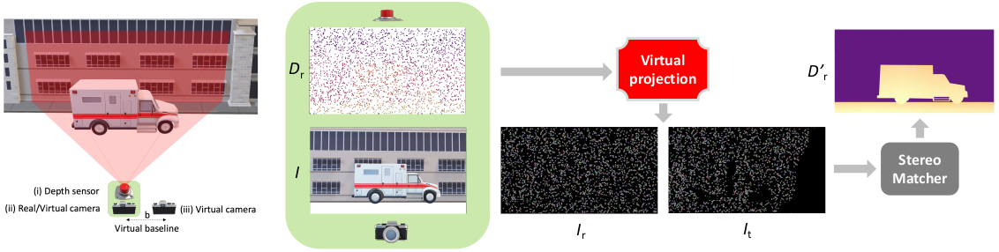
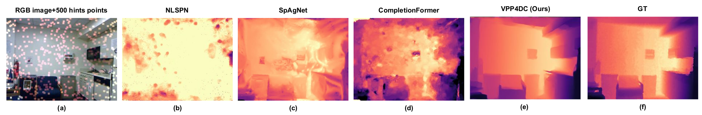
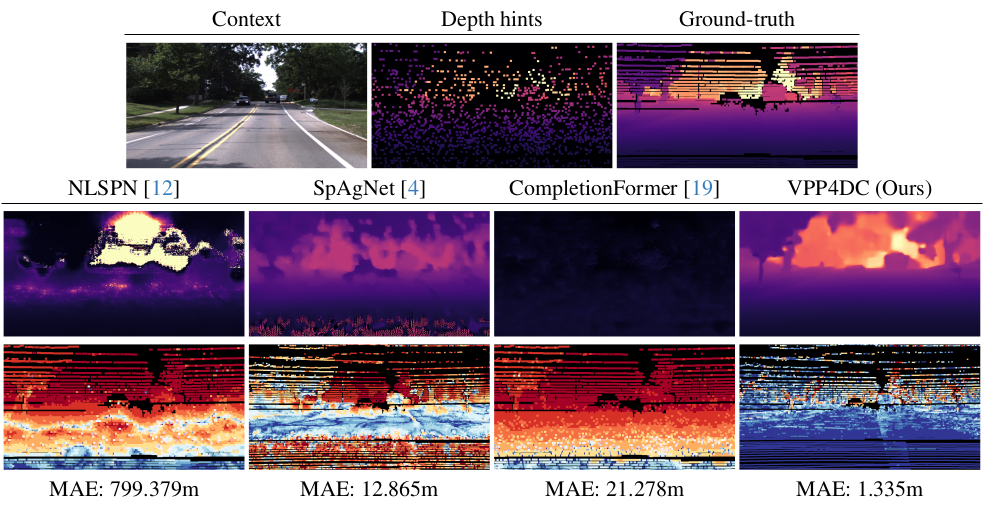
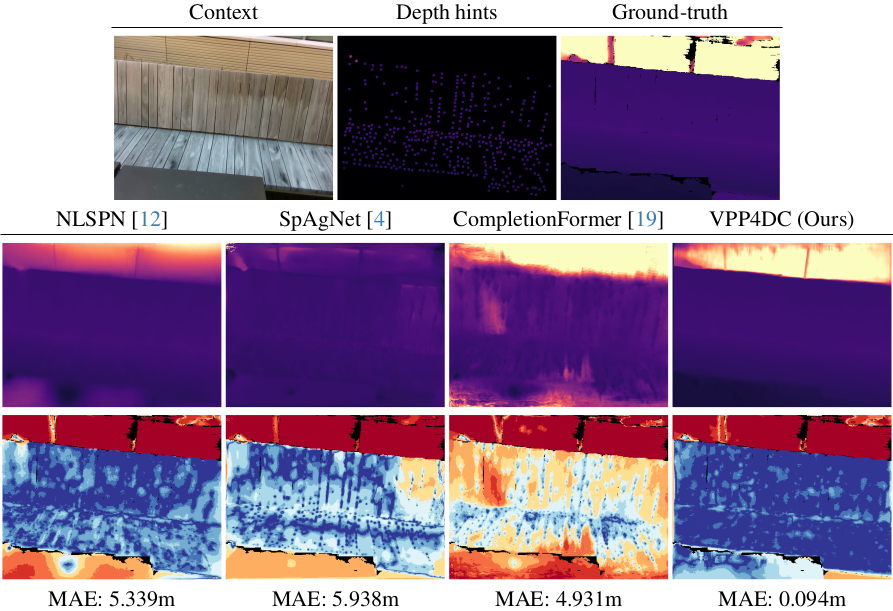

<h1 align="center"> Revisiting Depth Completion from a Stereo Matching Perspective for Cross-domain Generalization (3DV 2024) </h1> 


<br>

🚨 This repository contains download links to our code, and trained deep stereo models of our work  "**Revisiting Depth Completion from a Stereo Matching Perspective for Cross-domain Generalization**",  [3DV 2024](https://3dvconf.github.io/2024/)
 
by [Luca Bartolomei](https://bartn8.github.io/)<sup>1,2</sup>, [Matteo Poggi](https://mattpoggi.github.io/)<sup>1,2</sup>, [Andrea Conti](https://andreaconti.github.io/)<sup>2</sup>, [Fabio Tosi](https://fabiotosi92.github.io/)<sup>2</sup>, and [Stefano Mattoccia](https://github.com/stefano-mattoccia)<sup>1,2</sup>

Advanced Research Center on Electronic System (ARCES)<sup>1</sup>
University of Bologna<sup>2</sup>

<div class="alert alert-info">


<h2 align="center"> 

[Project Page](https://vppdc.github.io/) | [Paper](https://vppdc.github.io/assets/paper.pdf) |  [Supplementary](https://vppdc.github.io/assets/paper-supp.pdf) 
</h2>

**Note**: 🚧 Kindly note that this repository is currently in the development phase. We are actively working to add and refine features and documentation. We apologize for any inconvenience caused by incomplete or missing elements and appreciate your patience as we work towards completion.

We would like to share with you our previous work [Active Pattern Without Pattern Projector](https://github.com/bartn8/vppstereo) from which we took inspiration for this work.

## :bookmark_tabs: Table of Contents

- [:bookmark\_tabs: Table of Contents](#bookmark_tabs-table-of-contents)
- [:clapper: Introduction](#clapper-introduction)
- [:inbox\_tray: Pretrained Models](#inbox_tray-pretrained-models)
- [:memo: Code](#memo-code)
  - [:hammer\_and\_wrench: Setup Instructions](#hammer_and_wrench-setup-instructions)
- [:floppy\_disk: Datasets](#floppy_disk-datasets)
- [:rocket: Test](#rocket-test)
- [:art: Qualitative Results](#art-qualitative-results)
- [:envelope: Contacts](#envelope-contacts)
- [:pray: Acknowledgements](#pray-acknowledgements)

</div>

## :clapper: Introduction
This paper proposes a new framework for depth comple-tion robust against domain-shifting issues. It exploits the generalization capability of modern stereo networks to face depth completion, by processing fictitious stereo pairs obtained through a virtual pattern projection paradigm. Any stereo network or traditional stereo matcher can be seamlessly plugged into our framework, allowing for the deployment of a virtual stereo setup that is future-proof against advancement in the stereo field.


<h4 align="center">

</h4>




**Contributions:** 

* We cast depth completion as a virtual stereo correspondence problem, where two appropriately patterned virtual images enable us to face depth completion with robust stereo-matching algorithms or networks.

* Extensive experimental results with multiple datasets and networks demonstrate that our proposal vastly outperforms state-of-the-art concerning generalization capability.


:pushpin: If you find this code useful in your research, please cite:

```bibtex
@inproceedings{Bartolomei_2024_3DV,
    author    = {Bartolomei, Luca and Poggi, Matteo and Conti, Andrea and Tosi, Fabio and Mattoccia, Stefano},
    title     = {Revisiting Depth Completion from a Stereo Matching Perspective for Cross-domain Generalization},
    journal={arXiv preprint arXiv},
    year={2024}
}
```

## :inbox_tray: Pretrained Models

Here, you can download the weights of **RAFT-Stereo** architecture. 
- **Vanilla Models**: these models are pretrained on Sceneflow vanilla images and Middlebury vanilla images
  - RAFT-Stereo vanilla models (_raft-stereo/sceneflow-raftstereo.tar_)
- **Fine-tuned Models**: starting from vanilla models, these models (_sceneflow-*-raftstereo.tar_) are finetuned in a specific real domain.
- **Models trained from scratch**: these models (_*-raftstereo.tar_) are trained from scratch using our framework


To use these weights, please follow these steps:

1. Install [GDown](https://github.com/wkentaro/gdown) python package: `pip install gdown`
2. Download all weights from our drive: `gdown --folder https://drive.google.com/drive/folders/1AZRHzCn7K7HiPQZocfxWplYHo3WhI8lm?usp=sharing`

**Our drive will be available soon**

## :memo: Code

The **Test** section provides scripts to evaluate depth estimation models on datasets like **VOID**, **NYU**, **DDAD** and **KITTIDC**. It helps assess the accuracy of the models and saves predicted depth maps.

Please refer to each section for detailed instructions on setup and execution.

<div class="alert alert-info">

**Warning**:
- Please be aware that we will not be releasing the training code for deep models. The provided code focuses on evaluation and demonstration purposes only. 
- With the latest updates in PyTorch, slight variations in the quantitative results compared to the numbers reported in the paper may occur.

</div>


### :hammer_and_wrench: Setup Instructions

Ensure that you have installed all the necessary dependencies.
The list of dependencies can be found in the `./requirements.txt` file.

You can also follow this script to create a virtual environment and install all the dependencies:

```bash
$ conda create -n "vppdc" python=3.7
$ conda activate vppdc
$ python -m pip install -r requirements.txt
```

## :floppy_disk: Datasets
We used two datasets for training and evaluation.

### NYU Depth V2 (NYUv2)

We used preprocessed NYUv2 HDF5 dataset provided by [Andrea Conti](https://github.com/andreaconti/sparsity-agnostic-depth-completion).

```bash
$ cd PATH_TO_DOWNLOAD
$ wget https://github.com/andreaconti/sparsity-agnostic-depth-completion/releases/download/v0.1.0/nyu_img_gt.h5
$ wget https://github.com/andreaconti/sparsity-agnostic-depth-completion/releases/download/v0.1.0/nyu_pred_with_500.h5
```

After that, you will get a data structure as follows:

```
nyudepthv2
├── nyu_img_gt.h5
└── nyu_pred_with_500.h5
```

Note that the original full NYUv2 dataset is available at the [official website](https://cs.nyu.edu/~silberman/datasets/nyu_depth_v2.html).


### VOID

You can download VOID dataset with different amount of sparse points (i.e., 150, 500, 1500) following this script:

```bash
$ cd PATH_TO_DOWNLOAD
$ ./download_void.sh
```

After that, you will get a data structure as follows:

```
void
├── 150
│    ├── void_150
│    │    └── data
│    │          ├── birthplace_of_internet
|    |          └── ...
|    |          
│    ├── test_absolute_pose.txt
│    └── ...
├── 500
│    ├── void_150
│    │    └── data
│    │          ├── birthplace_of_internet
|    |          └── ...
|    |          
│    ├── test_absolute_pose.txt
│    └── ...
...
```
Note that the script erases zip files. Raw VOID dataset is available at the [official website](https://github.com/alexklwong/void-dataset).

### KITTIDC

You can download KITTIDC validation split from the [official website](https://www.cvlibs.net/datasets/kitti/eval_depth.php?benchmark=depth_completion). You can also directly download it:

```bash
$ cd PATH_TO_DOWNLOAD
$ mkdir kitti_dc
$ cd kitti_dc
$ wget https://s3.eu-central-1.amazonaws.com/avg-kitti/data_depth_selection.zip
$ unzip data_depth_selection.zip
$ rm data_depth_selection.zip
$ ln -s depth_selection data_depth_selection
```

After that, you will get a data structure as follows:

```
kitti_dc
├── val_selection_cropped
│    ├── groundtruth_depth
│    ├── image
│    ├── intrinsics
│    └── velodyne_raw
├── test_depth_completion_anonymous
└── test_depth_prediction_anonymous
```

### DDAD

First of all, please install [Dataset Governance Policy (DGP)](https://github.com/TRI-ML/dgp) following the [official guide](https://github.com/TRI-ML/dgp/blob/master/docs/VIRTUAL_ENV.md).

Then, you can download and extract the full dataset:

```bash
$ cd PATH_TO_DOWNLOAD
$ wget https://tri-ml-public.s3.amazonaws.com/github/DDAD/datasets/DDAD.tar
$ tar -xvf DDAD.tar
```

After that, you will get a data structure as follows:

```
ddad_train_val
├── 000000
├── 000001
|
...
|
├── ddad.json
└── LICENSE.md
```

Finally, you can use our script to generate the validation data from the front camera:

```bash
python convert_ddad.py -i /path/to/ddad_train_val -o /your/output/path/sampled_ddad [--seed]
```

After that, you will get a data structure as follows:

```
sampled_ddad
└── val
     ├── gt
     |    ├──  0000000000.png
     |    ...     
     ├── hints 
     |    ├──  0000000000.png
     |    ...
     ├── intrinsics
     |    ├──  0000000000.txt
     |    ...     
     └── rgb
          ├──  0000000000.png
          ...
```

## :rocket: Test

This code snippet allows you to evaluate the depth maps on various datasets, including [KITTIDC](https://www.cvlibs.net/datasets/kitti/eval_depth.php?benchmark=depth_completion), [NYU](https://cs.nyu.edu/~silberman/datasets/nyu_depth_v2.html), [VOID](https://github.com/alexklwong/void-dataset) and [DDAD](https://github.com/TRI-ML/DDAD). By executing the provided script, you can assess the accuracy of depth completion models on these datasets.

To run the `test.py` script with the correct arguments, follow the instructions below:

1. **Run the test**:
   - Open a terminal or command prompt.
   - Navigate to the directory containing the `test.py` script.

2. **Execute the command**:
  Run the following command, replacing the placeholders with the actual values for your images and model:

  ```shell
  export CUDA_VISIBLE_DEVICES=0 
  python test.py  --datapath <path_to_dataset> --dataset <dataset_type> --model <model_name> \
    --loadmodel <path_to_pretrained_model> --maxdisp 192 --outdir <output_directory> \
    --wsize 5 --guideperc 1 --blending 1 --interpolate --filling --leftpadding --filterlidar  \
    --maskocc --iscale <input_image_scale>

  ```

  Replace the placeholders (<max_disparity>, <path_to_dataset>, <dataset_type>, etc.) with the actual values for your setup.

  The available arguments are:

  - `--maxdisp`: Maximum disparity range for SGM (default 256).
  - `--model`: Stereo model type. Options: `raft-stereo` `sgm`
  - `--datapath`: Specify the dataset path.
  - `--dataset`: Specify dataset type. Options: `kittidcval`, `nyudepthv2`, `void`, `myddad`
  - `--outdir`: Output directory to save the disparity maps.
  - `--loadmodel`: Path to the pretrained model file.
  - `--iscale` Rescale input images before apply vpp and stereo matching. Original size is restored before evaluation. Example: `--iscale 1` equals full scale, `--iscale 2` equals half scale.
  - `--guideperc`: Simulate depth seeds using a certain percentage of randomly sampled GT points. Valid only if raw depth seed not exists.
  - `--uniform_color`: Uniform patch strategy
  - `--wsize`: Pattern patch size (e.g., 1, 3, 5, 7, ...)
  - `--blending`: Alpha-bleding between original images and virtual pattern
  - `--maskocc`: Use occlusion handling
  - `--filterlidar`: Filter depth hints (For DDAD and KITTIDC only)
  - `--filling`: Use our proposed hints filling strategy
  - `--leftpadding`: Add a left padding to handle left border occlusions
  - `--interpolate`: Virtual projection splatting accordingly to sub-pixel value.

For more details, please refer to the `test.py` script.

## :art: Qualitative Results

In this section, we present illustrative examples that demonstrate the effectiveness of our proposal.

<br>

<p float="left">
  
</p>
 
**Synth-to-real generalization.** Given an NYU Depth V2 frame and 500 sparse depth points (a), our framework with RAFT-Stereo trained only on the Sceneflow synthetic dataset (e) outperforms the generalization capability of state-of-the-art depth completion networks [NLSPN](https://github.com/zzangjinsun/NLSPN_ECCV20) (b), [SpAgNet](https://github.com/andreaconti/sparsity-agnostic-depth-completion) (c), and [CompletionFormer](https://github.com/youmi-zym/CompletionFormer) (d) – all trained on the same synthetic dataset.
 
<br>

<p float="left">
  
</p>

**From indoor to outdoor.** When it comes to pre-training on SceneFlow and train on indoor data then run the model outdoor, significant domain shift occurs. NLPSN and CompletionFormer seem unable to generalize to outdoor data, while SpAgNet can produce some meaningful depth maps, yet far from being accurate. Finally, VPP4DC can improve the results even further thanks to the pre-training process.

<br>

<p float="left">
  
</p>

**From outdoor to indoor.** we consider the case complementary to the previous one – i.e., with models pre-trained on SceneFlow and trained outdoor then tested indoor. NLSPN, CompletionFormer and SpAgNet can predict a depth map that is reasonable to some extent. Our approach instead predicts very accurate results on regions covered by depth hints, yet failing where these are absent.

## :envelope: Contacts

For questions, please send an email to luca.bartolomei5@unibo.it


## :pray: Acknowledgements

We would like to extend our sincere appreciation to the authors of the following projects for making their code available, which we have utilized in our work:

- We would like to thank the authors of [RAFT-Stereo](https://github.com/princeton-vl/RAFT-Stereo) for providing their code, which has been instrumental in our depth completion experiments.

We deeply appreciate the authors of the competing research papers for provision of code and model weights, which greatly aided accurate comparisons.
